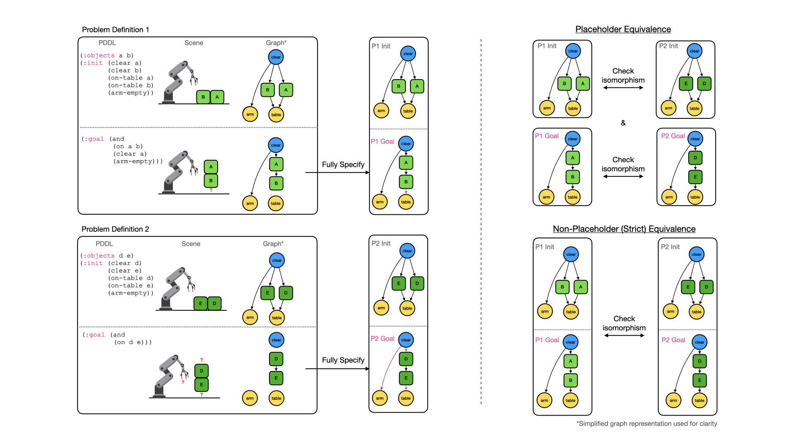

# planetarium🪐

<p align="center">
    <a href="https://arxiv.org/abs/2407.03321"></a>
</p>

Planetarium🪐 is a [dataset](https://huggingface.co/datasets/BatsResearch/planetarium) and benchmark for assessing LLMs in translating natural language descriptions of planning problems into PDDL. We developed a robust method for comparing PDDL problem descriptions using graph isomorphism.

## Installation
To install the `planetarium` package, you can use the following command:
```bash
pip install git+https://github.com/BatsResearch/planetarium.git
```

For development or using our evaluate & finetune scripts, you can clone the repository and install all dependencies using the following commands:
```bash
git clone https://github.com/BatsResearch/planetarium.git
cd planetarium
poetry install --with all
```

To use `planetarium.downward`, you will need to have the [Fast-Downward](https://www.fast-downward.org/) planner installed, and the [VAL](https://github.com/KCL-Planning/VAL) plan validator. The following commands is one way to install them with minimal overhead:
```bash
# Fast-Downward via Apptainer
apptainer pull fast-downward.sif docker://aibasel/downward:latest
# VAL download link might not work, follow instructions to download binary at: https://github.com/KCL-Planning/VAL
mkdir tmp
curl -o tmp/VAL.zip https://dev.azure.com/schlumberger/4e6bcb11-cd68-40fe-98a2-e3777bfec0a6/_apis/build/builds/77/artifacts?artifactName=linux64\&api-version=7.1\&%24format=zip
unzip tmp/VAL.zip -d tmp/
tar -xzvf tmp/linux64/*.tar.gz -C tmp/ --strip-components=1
# clean up
rm -rf tmp
# Make sure to add fast-downward.sif and VAL to your PATH or make aliases.
```

## Basic Usage
To evaluate a PDDL problem description, we can use the `planetarium.evaluate` module:
```python
import planetarium
...
planetarium.evaluate(gt_pddl_str, pred_pddl_str)
```
The supported domains are `blocksworld` and `gripper` domains.

## Dataset
The main page for the dataset can be found [here](https://huggingface.co/datasets/BatsResearch/planetarium).

Here is an example of how to load the dataset:
```python
from datasets import load_dataset

dataset = load_dataset("BatsResearch/planetarium")
```
Here, `dataset["test"]` is the main test set used in the paper. You may evaluate on this set to reproduce our results.

You can reporduce the dataset, the splits, and a report by running the following command:
```bash
python dataset_generator.py -c dataset_config.yaml
```

By modifying the `dataset_config.yaml` file, you can change the dataset splits, the number of samples, and produce even more examples!

### Dataset Report
Here is a summary of the types of PDDL problems in the dataset:

Total number of problems: $132,037$.

#### Abstractness Split
| Init | Goal | blocksworld | gripper |
|:---:|:---:|---:|---:|
| abstract | abstract | $23,144$ | $10,632$ |
| abstract | explicit | $23,086$ | $9,518$ |
| explicit | abstract | $23,087$ | $10,313$ |
| explicit | explicit | $23,033$ | $9,224$ |
#### Size Splits (Number of Propositions in Ground Truth)
| Num. of Propositions | blocksworld | gripper |
|:---:|---:|---:|
| $0$ - $20$ | $1,012$ | $379$ |
| $20$ - $40$ | $10,765$ | $2,112$ |
| $40$ - $60$ | $50,793$ | $9,412$ |
| $60$ - $80$ | $26,316$ | $25,346$ |
| $80$ - inf | $3,464$ | $2,438$ |

## How it Works
Planetarium🪐 compares two PDDL problem descriptions by first transcribing them into a graph representation.
Graphs help us to better detect and manipulate relationships between certain objects and propositions.
Next, we build "fully specified" graph representations by adding "trivial" propositions (propositions that do not exist in the problem description but must exist in any state that satisfies such description).
Finally, we use graph isomorphism to compare the fully specified graph representations of the two PDDL problem descriptions, either comparing the entire problem graph or the individual initial and goal scene graphs.
This lets check correctness of the translation of the natural language description into PDDL, without ever needing to run a planner.

Below is a flowchart providing an overview of the equivalence algorithm:


<p style="text-align: center;">(Left) Two planning problems, in PDDL problem description, real-world scenario, and graph representations. (Center) Fully specified graph representation. (Right) Graph isomorphism.</p>

The key to this algorithm working is building a specially crafted "fully specify" function, which we build for each domain that we want to support. We provide implementations for the `blocksworld` and `gripper` domains in the `planetarium.oracle` module.
